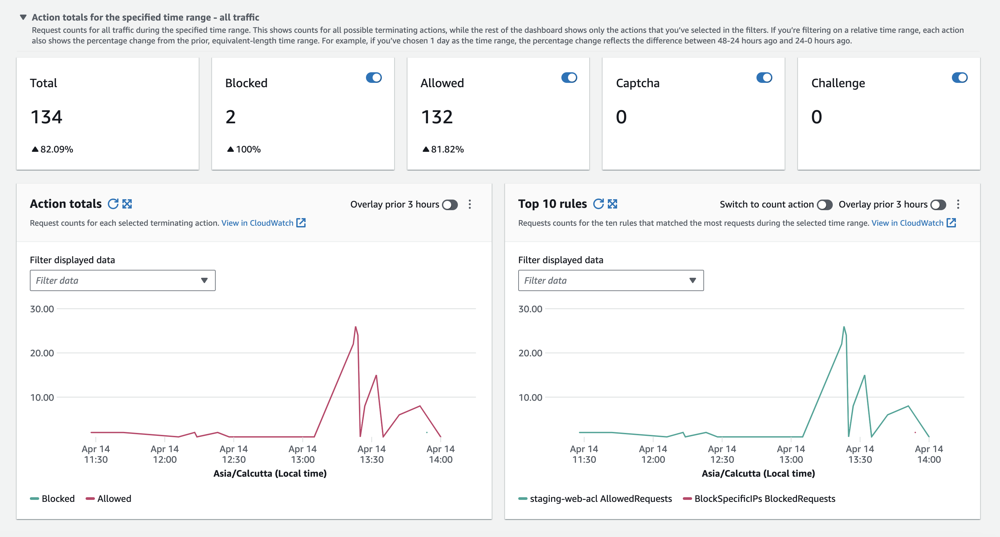

# Zero-to-Hero-Deploying-a-Full-Stack-AWS-Architecture-Using-Terraform

==============================

## Requirements

| Name | Version |
|------|---------|
|  [terraform](#requirement\_terraform) | >= 0.15.0 |
|  [aws](#requirement\_aws) | >= 4.29.0 |
|  [random](#requirement\_random) | >= 3.6.0 |
|  [template](#requirement\_template) | >= 2.2.0 |

## Providers

| Name | Version |
|------|---------|
|  [aws](#provider\_aws) | >= 4.29.0 |
|  [random](#provider\_random) | >= 3.6.0 |
|  [template](#provider\_template) | >= 2.2.0 |

## Modules

No modules.

## Resources

| Name | Type |
|------|------|
| [aws_acm_certificate.example_cert](https://registry.terraform.io/providers/hashicorp/aws/latest/docs/resources/acm_certificate) | resource |
| [aws_acm_certificate_validation.example_cert](https://registry.terraform.io/providers/hashicorp/aws/latest/docs/resources/acm_certificate_validation) | resource |
| [aws_autoscaling_group.app_asg](https://registry.terraform.io/providers/hashicorp/aws/latest/docs/resources/autoscaling_group) | resource |
| [aws_autoscaling_policy.web_policy_down](https://registry.terraform.io/providers/hashicorp/aws/latest/docs/resources/autoscaling_policy) | resource |
| [aws_autoscaling_policy.web_policy_up](https://registry.terraform.io/providers/hashicorp/aws/latest/docs/resources/autoscaling_policy) | resource |
| [aws_cloudwatch_metric_alarm.web_cpu_alarm_down](https://registry.terraform.io/providers/hashicorp/aws/latest/docs/resources/cloudwatch_metric_alarm) | resource |
| [aws_cloudwatch_metric_alarm.web_cpu_alarm_up](https://registry.terraform.io/providers/hashicorp/aws/latest/docs/resources/cloudwatch_metric_alarm) | resource |
| [aws_db_instance.db](https://registry.terraform.io/providers/hashicorp/aws/latest/docs/resources/db_instance) | resource |
| [aws_db_subnet_group.rds_subnet_group](https://registry.terraform.io/providers/hashicorp/aws/latest/docs/resources/db_subnet_group) | resource |
| [aws_efs_file_system.app_efs](https://registry.terraform.io/providers/hashicorp/aws/latest/docs/resources/efs_file_system) | resource |
| [aws_efs_mount_target.efs_mt](https://registry.terraform.io/providers/hashicorp/aws/latest/docs/resources/efs_mount_target) | resource |
| [aws_eip.nat](https://registry.terraform.io/providers/hashicorp/aws/latest/docs/resources/eip) | resource |
| [aws_iam_instance_profile.ssm_instance_profile](https://registry.terraform.io/providers/hashicorp/aws/latest/docs/resources/iam_instance_profile) | resource |
| [aws_iam_role.ssm_role](https://registry.terraform.io/providers/hashicorp/aws/latest/docs/resources/iam_role) | resource |
| [aws_iam_role_policy_attachment.ssm_policies](https://registry.terraform.io/providers/hashicorp/aws/latest/docs/resources/iam_role_policy_attachment) | resource |
| [aws_internet_gateway.gw](https://registry.terraform.io/providers/hashicorp/aws/latest/docs/resources/internet_gateway) | resource |
| [aws_launch_template.app](https://registry.terraform.io/providers/hashicorp/aws/latest/docs/resources/launch_template) | resource |
| [aws_lb.app_alb](https://registry.terraform.io/providers/hashicorp/aws/latest/docs/resources/lb) | resource |
| [aws_lb_listener.front_end](https://registry.terraform.io/providers/hashicorp/aws/latest/docs/resources/lb_listener) | resource |
| [aws_lb_listener.https](https://registry.terraform.io/providers/hashicorp/aws/latest/docs/resources/lb_listener) | resource |
| [aws_lb_target_group.app_tg](https://registry.terraform.io/providers/hashicorp/aws/latest/docs/resources/lb_target_group) | resource |
| [aws_nat_gateway.nat](https://registry.terraform.io/providers/hashicorp/aws/latest/docs/resources/nat_gateway) | resource |
| [aws_route53_record.cert_validation](https://registry.terraform.io/providers/hashicorp/aws/latest/docs/resources/route53_record) | resource |
| [aws_route53_record.www](https://registry.terraform.io/providers/hashicorp/aws/latest/docs/resources/route53_record) | resource |
| [aws_route53_zone.main](https://registry.terraform.io/providers/hashicorp/aws/latest/docs/resources/route53_zone) | resource |
| [aws_route_table.private](https://registry.terraform.io/providers/hashicorp/aws/latest/docs/resources/route_table) | resource |
| [aws_route_table.public](https://registry.terraform.io/providers/hashicorp/aws/latest/docs/resources/route_table) | resource |
| [aws_route_table_association.private](https://registry.terraform.io/providers/hashicorp/aws/latest/docs/resources/route_table_association) | resource |
| [aws_route_table_association.public](https://registry.terraform.io/providers/hashicorp/aws/latest/docs/resources/route_table_association) | resource |
| [aws_security_group.alb_sg](https://registry.terraform.io/providers/hashicorp/aws/latest/docs/resources/security_group) | resource |
| [aws_security_group.ec2_sg](https://registry.terraform.io/providers/hashicorp/aws/latest/docs/resources/security_group) | resource |
| [aws_security_group.efs_sg](https://registry.terraform.io/providers/hashicorp/aws/latest/docs/resources/security_group) | resource |
| [aws_security_group.rds_sg](https://registry.terraform.io/providers/hashicorp/aws/latest/docs/resources/security_group) | resource |
| [aws_ssm_parameter.db_password](https://registry.terraform.io/providers/hashicorp/aws/latest/docs/resources/ssm_parameter) | resource |
| [aws_subnet.private](https://registry.terraform.io/providers/hashicorp/aws/latest/docs/resources/subnet) | resource |
| [aws_subnet.public](https://registry.terraform.io/providers/hashicorp/aws/latest/docs/resources/subnet) | resource |
| [aws_vpc.main](https://registry.terraform.io/providers/hashicorp/aws/latest/docs/resources/vpc) | resource |
| [aws_wafv2_ip_set.block_ip_set](https://registry.terraform.io/providers/hashicorp/aws/latest/docs/resources/wafv2_ip_set) | resource |
| [aws_wafv2_web_acl.main_acl](https://registry.terraform.io/providers/hashicorp/aws/latest/docs/resources/wafv2_web_acl) | resource |
| [aws_wafv2_web_acl_association.alb_assoc](https://registry.terraform.io/providers/hashicorp/aws/latest/docs/resources/wafv2_web_acl_association) | resource |
| [random_password.root_password](https://registry.terraform.io/providers/hashicorp/random/latest/docs/resources/password) | resource |
| [aws_kms_key.db_kms_key](https://registry.terraform.io/providers/hashicorp/aws/latest/docs/data-sources/kms_key) | data source |
| [aws_route53_zone.main](https://registry.terraform.io/providers/hashicorp/aws/latest/docs/data-sources/route53_zone) | data source |
| [template_file.user_data](https://registry.terraform.io/providers/hashicorp/template/latest/docs/data-sources/file) | data source |

## Inputs

| Name | Description | Type | Default | Required |
|------|-------------|------|---------|:--------:|
|  [alb\_sg\_egress\_rules](#input\_alb\_sg\_egress\_rules) | n/a | `any` | `{}` | no |
|  [alb\_sg\_ingress\_rules](#input\_alb\_sg\_ingress\_rules) | alb | `any` | `{}` | no |
|  [ami\_id](#input\_ami\_id) | The AMI ID to be used for the EC2 instances. | `string` | n/a | yes |
|  [ec2\_sg\_egress\_rules](#input\_ec2\_sg\_egress\_rules) | n/a | `any` | `{}` | no |
|  [ec2\_sg\_ingress\_rules](#input\_ec2\_sg\_ingress\_rules) | ec2 | `any` | `{}` | no |
|  [env](#input\_env) | n/a | `string` | n/a | yes |
|  [instance\_type](#input\_instance\_type) | The EC2 instance type for the Auto Scaling Group. | `string` | n/a | yes |
|  [private\_subnets](#input\_private\_subnets) | A map of private subnet CIDR blocks keyed by their respective availability zones. | `map(string)` | n/a | yes |
|  [public\_subnets](#input\_public\_subnets) | A map of public subnet CIDR blocks keyed by their respective availability zones. | `map(string)` | n/a | yes |
|  [rds\_conf](#input\_rds\_conf) | n/a | `any` | `{}` | no |
|  [rds\_sg\_egress\_rules](#input\_rds\_sg\_egress\_rules) | n/a | `any` | n/a | yes |
|  [rds\_sg\_ingress\_rules](#input\_rds\_sg\_ingress\_rules) | rds | `any` | n/a | yes |
|  [region](#input\_region) | The AWS region where resources will be created. | `string` | n/a | yes |
|  [vpc\_conf](#input\_vpc\_conf) | #VPC | `map(any)` | `{}` | no |

## Outputs

| Name | Description |
|------|-------------|
|  [alb\_arn](#output\_alb\_arn) | The ARN of the Application Load Balancer |
|  [alb\_dns\_name](#output\_alb\_dns\_name) | The DNS name of the Application Load Balancer |
|  [db\_endpoint](#output\_db\_endpoint) | n/a |
|  [db\_id](#output\_db\_id) | n/a |
|  [db\_name](#output\_db\_name) | n/a |
|  [db\_password\_ssm](#output\_db\_password\_ssm) | n/a |
|  [db\_username](#output\_db\_username) | n/a |
|  [efs\_file\_system\_id](#output\_efs\_file\_system\_id) | n/a |
|  [security\_group\_id](#output\_security\_group\_id) | The ID of the security group attached to the ALB |
|  [target\_group\_arn](#output\_target\_group\_arn) | The ARN of the target group used with the ALB |
|  [waf\_web\_acl\_arn](#output\_waf\_web\_acl\_arn) | The ARN of the Web ACL associated with the ALB |

You can find the video at [https://youtu.be/4C1Kle5MIo8](https://youtu.be/4C1Kle5MIo8) .
